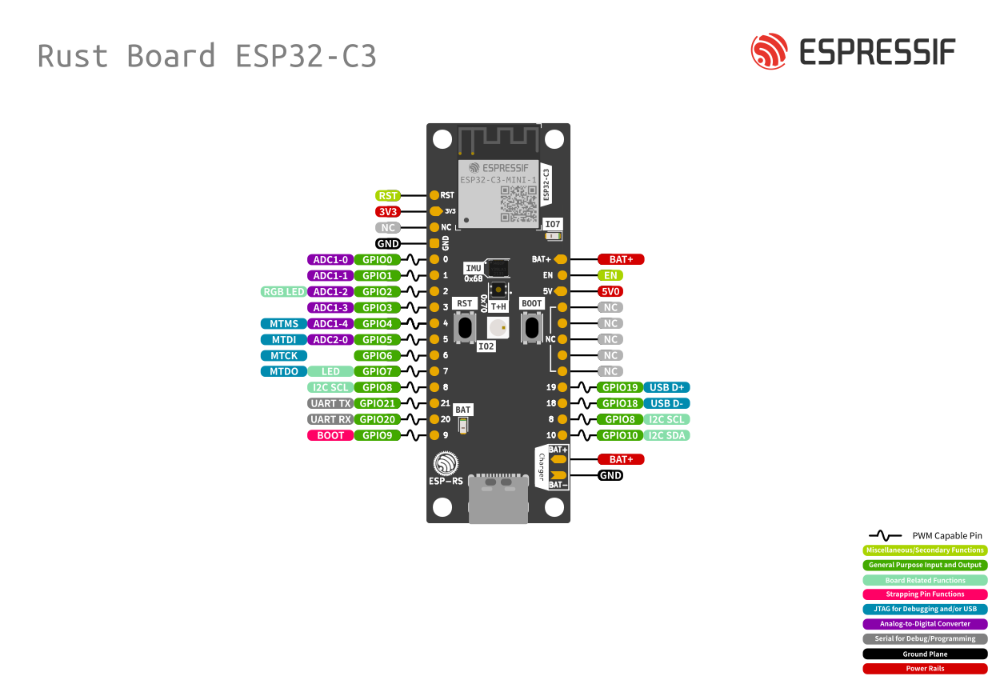

# Gale

A Zephyr demo that shows how to set up a multi-application project with a shared interface. Liberally uses the many kernel features and other utilities provided by Zephyr (some simple things are occasionally over-engineered for the sake of demonstration).

## Repositories

- [Manifest](https://github.com/JaagupAverin/gale-manifest) - west manifest and scripts for managing the Gale workspace
- [Sensor app](https://github.com/JaagupAverin/gale-sensor-app) - application demonstrating basic sensor usage
- [HMI app](https://github.com/JaagupAverin/gale-hmi-app) - application demonstrating basic HMI peripheral usage
- [Shared](https://github.com/JaagupAverin/gale-shared) - common code and scripts shared between applications
- [Zephyr fork](https://github.com/JaagupAverin/gale-zephyr) - Zephyr fork with project-specific adjustments


## Resources

### Datasheets

- [ESP32-C3-DevKit-RUST Zephyr page](https://docs.zephyrproject.org/latest/boards/espressif/esp32c3_rust/doc/index.html)
- [ESP32-C3-DevKit-RUST Github](https://github.com/esp-rs/esp-rust-board)
- [ESP32-C3-MINI-1 Datasheet](https://www.espressif.com/sites/default/files/documentation/esp32-c3-mini-1_datasheet_en.pdf)
  - Pin definitions in chapter 3 (page 10)
- [ESP32-C3 series Datasheet](https://www.espressif.com/sites/default/files/documentation/esp32-c3_datasheet_en.pdf)
  - Pin definitions in chapter 2 (page 10)
  - CPU and peripheral details in chapter 3

## Quickstart:

Install [west](https://docs.zephyrproject.org/latest/develop/west/install.html) for Zephyr management.

Install [uv](https://docs.astral.sh/uv/getting-started/installation/) for Python dependency management.

Clone all repositories:

```bash
mkdir gale_ws && cd gale_ws
west init -m https://github.com/JaagupAverin/gale-manifest
west update
```

Configure environment and install dependencies:

```bash
cd gale
uv add -r requirements.txt
uv sync
source .venv/bin/activate
west config zephyr.base gale/projects/zephyr
west sdk install
```

### Commands for development:

We have our own Python tool for project management. Defined under `gale/src/gale/main.py`, this CLI tool should
be available inside the virtual environment after calling `uv sync` from above.

See `gale --help` for all commands. Install shell completions using `gale --install-completion`.

e.g. for simulating an appliaction:

```bash
# Install QEMU dependencies:
gale setup
gale emulate sensor
```

## Appendix

### Pinout


