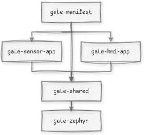

# Gale

A Zephyr demo that shows how to set up a multi-application project with a shared interface. Liberally uses the many kernel features and other utilities provided by Zephyr (some simple things are occasionally over-engineered for the sake of demonstration).

## Repositories

- [Manifest](https://github.com/JaagupAverin/gale-manifest) - west manifest and scripts for managing the Gale workspace
- [Sensor app](https://github.com/JaagupAverin/gale-sensor-app) - application demonstrating basic sensor usage
- [HMI app](https://github.com/JaagupAverin/gale-hmi-app) - application demonstrating basic HMI peripheral usage
- [Shared](https://github.com/JaagupAverin/gale-shared) - common code and scripts shared between applications
- [Zephyr fork](https://github.com/JaagupAverin/gale-zephyr) - Zephyr fork with project-specific adjustments



## Quickstart:

### Clone all repositories:

```bash
mkdir gale && cd gale
west init -m https://github.com/JaagupAverin/gale-manifest
west config manifest.group-filter +sensor,+hmi
west update
```

#### Alternatively, use the following to initialize only a specific application:
_Note that this can be reconfigured at any time and will simply affect which repositories are tracked by west._

```bash
west config manifest.group-filter +sensor
west update
```

### Install dependencies:

```bash
python -m venv .venv
source .venv/bin/activate
python -m pip install west
west packages pip --install
west sdk install
```

### Commands for development:

```bash
# Check status of all repositories:
west status

# Sync all repositories with origin (rebase recommended to not detach from current branch):
west update --rebase

# Checkout 'main' in all gale repositories:
west gale-checkout main

# Commit and push local changes in all gale repositories:
west gale-push "Updated stuff."
```
