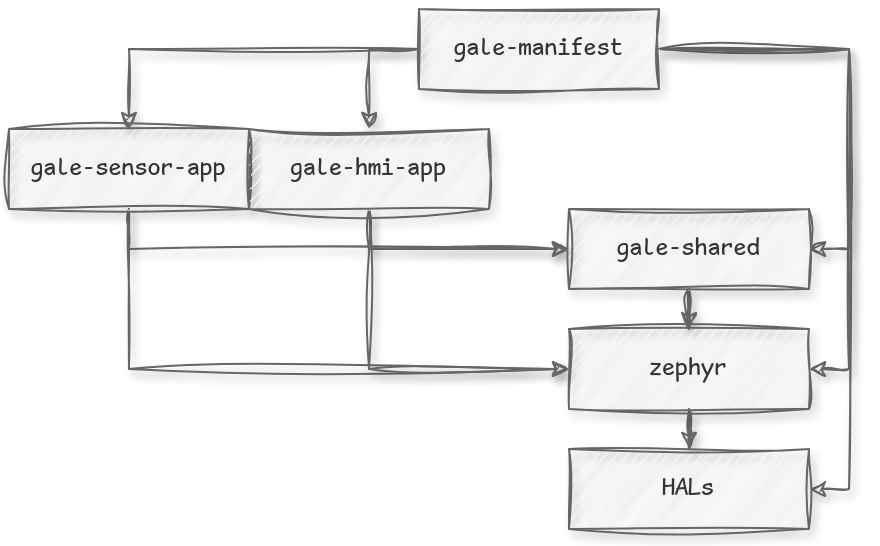

# Gale

A Zephyr demo that shows how to set up a multi-application project with a shared interface. Liberally uses the many kernel features and other utilities provided by Zephyr (some simple things are occasionally over-engineered for the sake of demonstration).

## Repositories

- [Manifest](https://github.com/JaagupAverin/gale-manifest) - west manifest and scripts for managing the Gale workspace
- [Sensor app](https://github.com/JaagupAverin/gale-sensor-app) - application demonstrating basic sensor usage
- [HMI app](https://github.com/JaagupAverin/gale-hmi-app) - application demonstrating basic HMI peripheral usage
- [Shared](https://github.com/JaagupAverin/gale-shared) - common code and scripts shared between applications
- [Zephyr fork](https://github.com/JaagupAverin/gale-zephyr) - Zephyr fork with project-specific adjustments



## Resources

### Datasheets

- [nRF54L15 Datasheet](https://docs.nordicsemi.com/bundle/ps_nrf54L15/page/keyfeatures_html5.html)
- [nrf54L15 HW](https://docs.nordicsemi.com/bundle/ug_nrf54l15_dk/page/UG/nRF54L15_DK/intro/intro.html)
- [native_sim](https://docs.nordicsemi.com/bundle/ncs-latest/page/zephyr/boards/native/native_sim/doc/index.html)

## Quickstart:

Install [west](https://docs.zephyrproject.org/latest/develop/west/install.html) for Zephyr management.

Install [uv](https://docs.astral.sh/uv/getting-started/installation/) for Python dependency management.

Install [nrfutil](https://www.nordicsemi.com/Products/Development-tools/nRF-Util) for nRF tooling.

Clone all repositories:

```bash
mkdir gale_ws && cd gale_ws
west init -m https://github.com/JaagupAverin/gale-manifest
west update
```

Configure environment and install dependencies:

```bash
cd gale
uv add -r projects/zephyr/scripts/requirements.txt
uv sync
source .venv/bin/activate
west config zephyr.base gale/projects/zephyr
west sdk install
```

Install nRF tools:

```bash
nrfutil install device
```

### Commands for development:

We have our own Python tool for project management. Defined under `gale/src/gale/main.py`, this CLI tool should
be available inside the virtual environment after calling `uv sync` from above.

See `gale --help` for all commands. Install shell completions using `gale --install-completion`.

e.g. for simulating an application:

```bash
gale run --board nrf54l15bsim --target hmi_app --real-time --rebuild
```

## Notable Zephyr features:

- Use of `CONFIG_ASAN=y` and `CONFIG_UBSAN=y`
- Use of `CONFIG_TRACING=y`
- Use of `CONFIG_FLASH_SIMULATOR=y` and `CONFIG_FUSE_FS_ACCESS=y`
- Use of `VERSION` file
- Use of C++20 and stdlib
- Use of littlefs with devicetree-based automounting (using fstab node)
- Use of BabbleSim for running apps on host machine
- Use of binary descriptors for storing data accessible both from the application and the build system
- Use of SCA (CodeChecker)

## Appendix

# Zephyr features still to review:

## Tooling:

- Use Static Code Analysis: https://docs.zephyrproject.org/latest/develop/sca/index.html
- Use sysbuild for multi-target project: https://docs.zephyrproject.org/latest/build/sysbuild/index.html#adding-zephyr-applications-to-sysbuild

## Testing:

- ZTest for unit testing: https://docs.zephyrproject.org/latest/develop/sca/index.html
- Advanced testing with:
  - Test runner: https://docs.zephyrproject.org/latest/develop/test/twister.html

## Features:

- Functionality:
  - Zbus (inter-thread communication channel): https://docs.zephyrproject.org/latest/services/zbus/index.html
  - Reference-counting On/Off manager: https://docs.zephyrproject.org/latest/services/resource_management/index.html
  - Async notifications: https://docs.zephyrproject.org/latest/services/notify.html
  - State machine skeleton: https://docs.zephyrproject.org/latest/services/smf/index.html#overview
  - Settings: https://docs.zephyrproject.org/latest/services/storage/settings/index.html
  - Task watchdog: https://docs.zephyrproject.org/latest/services/task_wdt/index.html
  - Retention storage: https://docs.zephyrproject.org/latest/services/retention/index.html
  - RTIO for real-time high performance processing: https://docs.zephyrproject.org/latest/services/rtio/index.html
  - CRC/JSON: https://docs.zephyrproject.org/latest/services/misc.html#json
  - Utils: https://docs.zephyrproject.org/latest/doxygen/html/group__sys-util.html
- Debugging:
  - Remote GDB debugging: https://docs.zephyrproject.org/latest/services/debugging/gdbstub.html#gdb-stub
  - Breakpoint-while-running: https://docs.zephyrproject.org/latest/services/debugging/debugmon.html#cortex-m-debug-monitor
  - Runtime address inspection: https://docs.zephyrproject.org/latest/services/debugging/symtab.html
- Misc:
  - Deffered device init: https://docs.zephyrproject.org/latest/kernel/drivers/index.html#deferred-initialization
  - Code relocation: https://docs.zephyrproject.org/latest/kernel/code-relocation.html

## References:

- DTS bindings: https://docs.zephyrproject.org/latest/build/dts/api/bindings.html
- KConfig: https://docs.zephyrproject.org/latest/kconfig.html
- HALs: https://docs.zephyrproject.org/latest/develop/manifest/index.html

## Devicetree layers for nrf54l15bsim:

- ./projects/zephyr/boards/native/nrf_bsim/nrf54l15bsim_nrf54l15_cpuapp.dts
- ./projects/zephyr/dts/arm/nordic/nrf54l15_cpuapp.dtsi
- ./projects/zephyr/dts/arm/nordic/nrf54l_05_10_15_cpuapp.dtsi
- ./projects/zephyr/dts/vendor/nordic/nrf54l15.dtsi
- ./projects/zephyr/dts/vendor/nordic/nrf54l_05_10_15.dtsi
- ./projects/zephyr/dts/vendor/nordic/nrf_common.dtsi
- ./projects/zephyr/boards/nordic/nrf54l15dk/nrf54l15dk_nrf54l_05_10_15-pinctrl.dtsi
